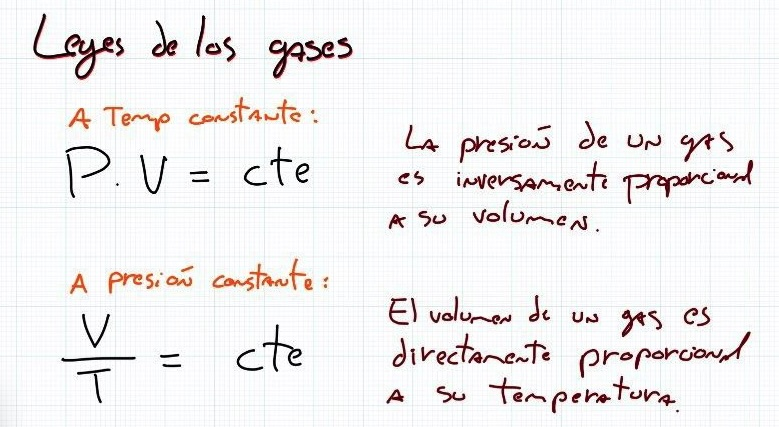
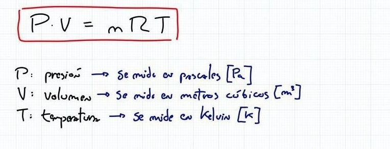
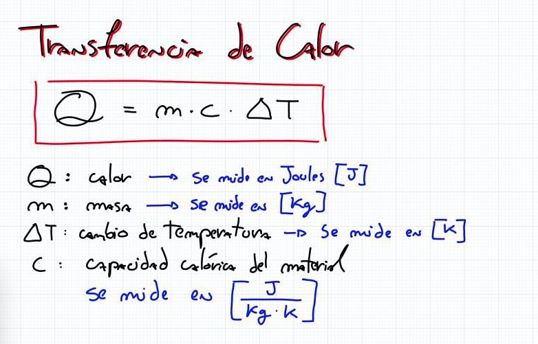
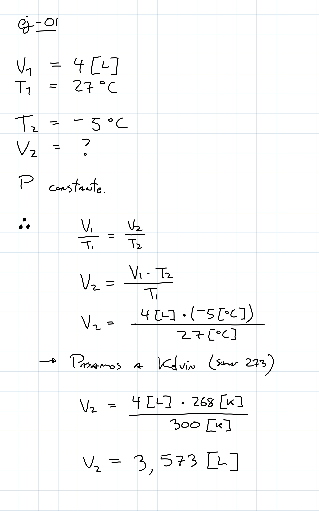
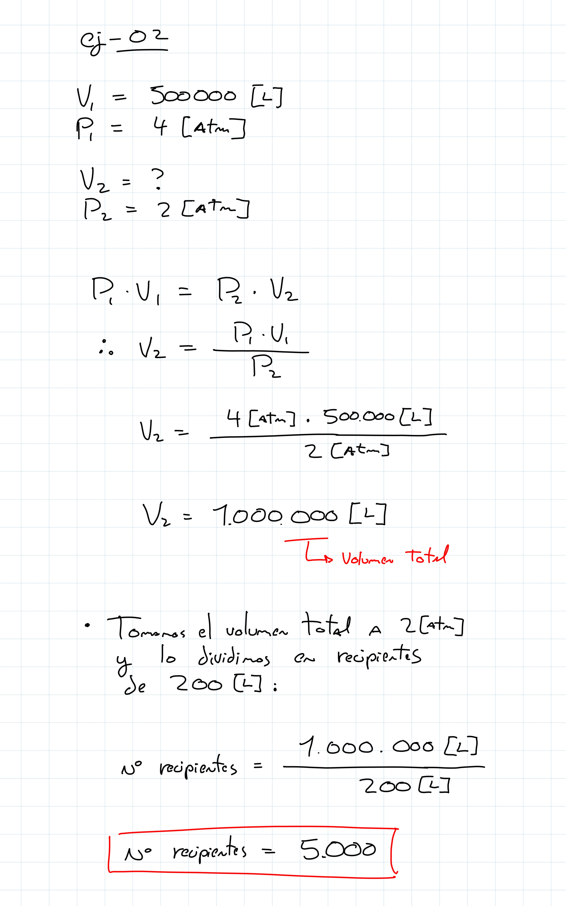
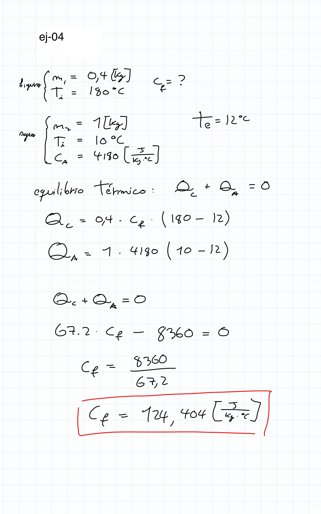

# ayudantia-08

viernes 10 mayo 2024

unidad 5: calor y temperatura

## resumen

## ejercicio-01

un globo tiene un volumen de 4 L de aire a 27 ºC. si el globo escapa y sube a dos kilómetros de altura, donde la temperatura es de -5 ºC ¿cual será el nuevo volumen del globo suponiendo la misma presión?

### solucion-ejercicio-01

## ejercicio-02

¿cuántos recipientes de $200[L]$ a $2[atm]$ de presión podrán llenarse con el gas propano contenido en un depósito de $500.000[L]$, que está a una presión de $4[atm]$? suponer temperatura constante.

### solucion-ejercicio-02

## ejercicio-03

Se mezclan $5 [L]$ de agua a $40[ºC]$ con $3[L]$ de alcohol a $15[ºC]$. ¿Cuál es su temperatura de equilibrio térmico?

$c_{agua} = 4180 [\frac{J}{Kg °C}]$

$c_{alcohol} = 2450 [\frac{J}{Kg °C}]$

$densidad_{alcohol} =0,79 [Kg/L]$

### solucion-ejercicio-03

## ejercicio-04

Una figura de metal de $0.4 [Kg]$ que está a $180 [ºC]$ se enfría sumergiéndola en $1 [L]$ de agua a $10ºC$.

Si la temperatura de equilibrio resulta ser de $12[°C]$, determinar el calor específico del metal.

$c_{agua} = 4180 [\frac{J}{Kg °C}]$

### solucion-ejercicio-04

