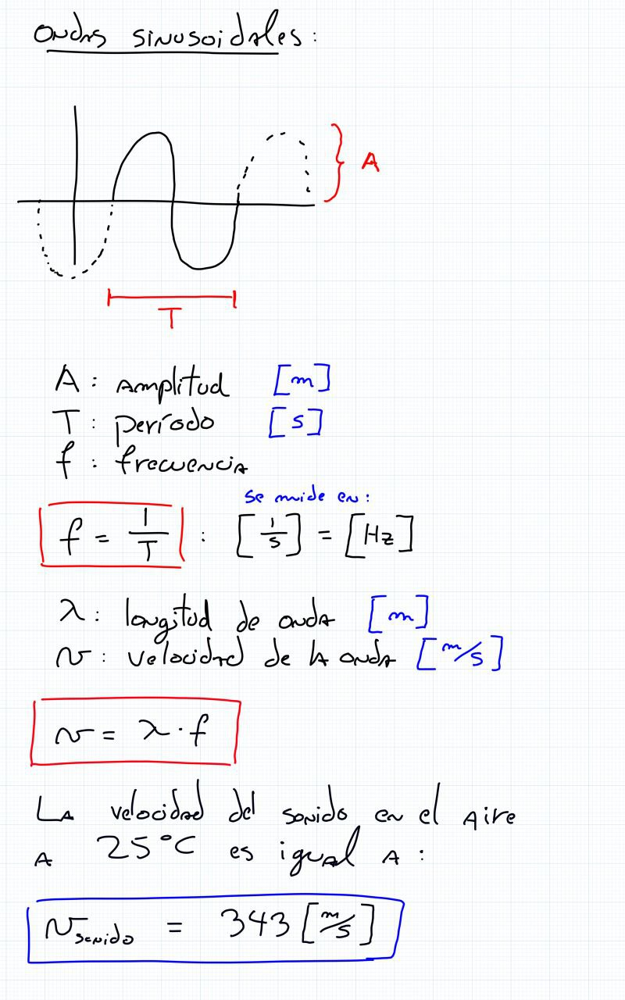
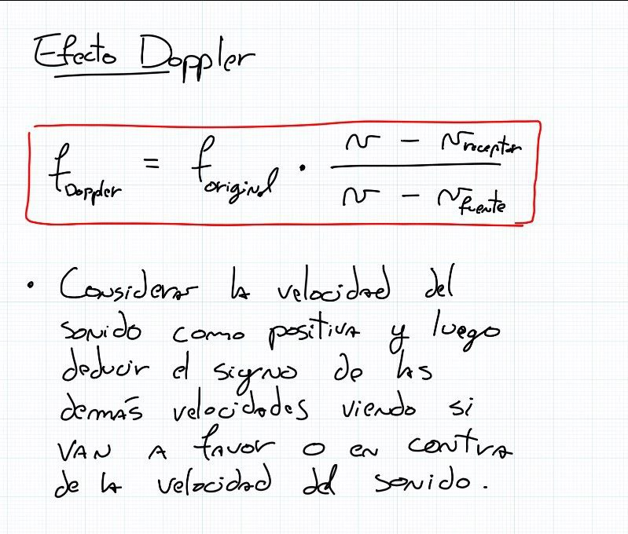
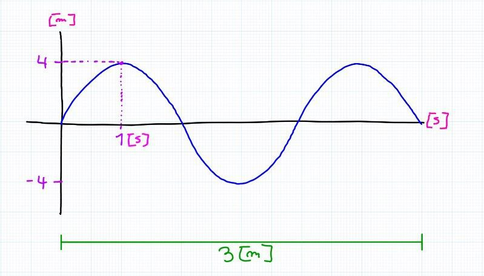
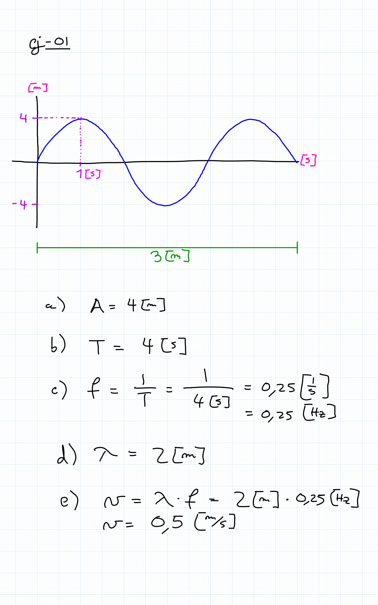
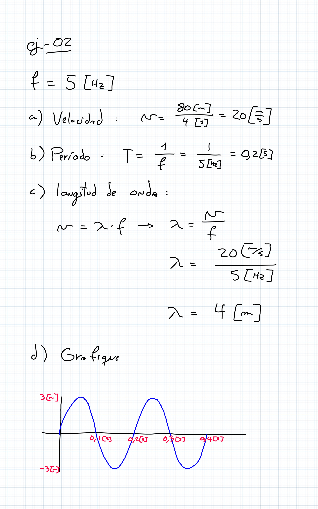
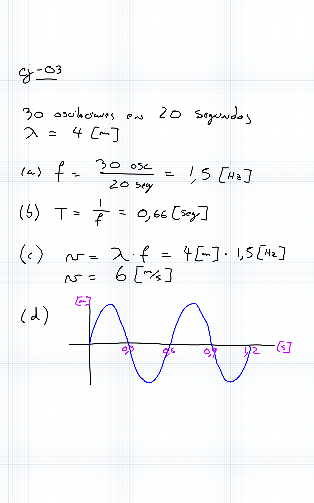

# ayudantia-09

viernes 17 mayo 2024

unidad 6: ondas y sonido

## resumen

## ejercicio-01

en el siguiente gráfico de una onda periódica, determine:

a) la amplitud de la onda

b) el período

c) la frecuencia

d) la longitud de onda

e) la velocidad de propagación

### solución-ejercicio-01

## ejercicio-02

una onda periódica de $5[Hz]$ y $3[m]$ se propaga en un medio avanzando $80[m]$ en $4[s]$. Determine:

a) La velocidad de propagación de la onda.

b) Su período (T)

c) Su longitud de onda ($\lambda$)

d) Grafique la onda en el tiempo dibujando al menos dos ciclos. Marque la amplitud. Marque el tiempo cada vez que la onda cruza el eje "x".

### solución

## ejercicio-03

Las vibraciones de una cuerda generan 30 oscilaciones durante 20 segundos con una longitud de onda de $4[m]$. Calcule:

a) La frecuencia de oscilación.

b) El período de oscilación.

c) La velocidad de las ondas en la cuerda.

d) Grafique la onda en el tiempo dibujando al menos dos ciclos. Marque el tiempo cada vez que la onda cruza el eje "x".

### solución-ejercicio-03

## ejercicio-04

Una ambulancia lleva una velocidad de $40 [m/s]$. Su sirena emite un sonido con una frecuencia de $400 [Hz]$.

Se cruza con un automóvil que transita en sentido contrario con una velocidad de $25 [m/s]$.

a) ¿Qué frecuencia percibirá el conductor del automóvil cuando los vehículos se aproximan? ¿Lo percibe más grave o más agudo?

b) ¿y cuando se alejan? ¿Lo percibe más grave o más agudo?

### solución-ejercicio-04

